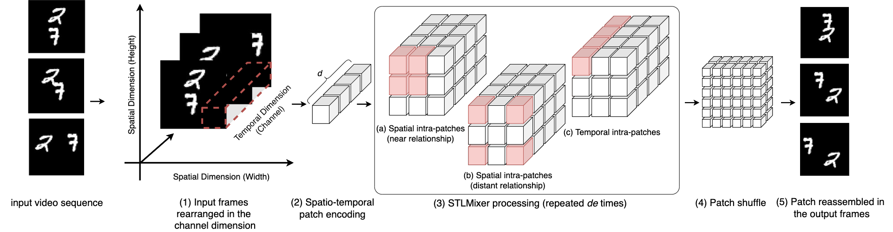
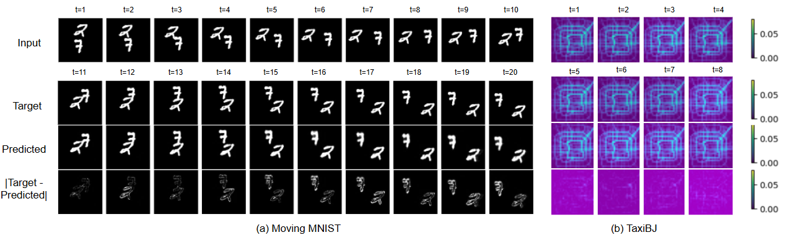

[[Home|Research Lab]]  /  [[Papers/Paper Guides|Paper Guides]]

# STLight: future frames without the RNN tax

> [!paper] Research reading guide
> Complete reading guide for STLight (arXiv 2411.10198): fully convolutional spatio-temporal prediction, STLMixer, pixel shuffle, FLOPs vs ConvLSTM/PredRNN.
>
> **Concepts:** 2 · **Related curriculum notes:** 1

> [!concepts] Connected concepts
> - [[Mind Map/Nodes/stlight|STLight]]
> - [[Mind Map/Nodes/transformers|Transformers]]

> [!study] Continue in the curriculum
> - [[Curriculum/Lessons/Day 23 - Vision Transformers & Patch Geometry|Day 23 - Vision Transformers & Patch Geometry]]

> [!source] Local reconstruction and provenance
> - This note contains the complete recreated reading guide; no published mirror is required.
> - Canonical editorial source: `site/papers-stlight.html`
> - Companion source: `papers/stlight.md`
> - Local figures: `_attachments/Papers/stlight/`
> - Primary papers, repositories, and videos remain linked as evidence.

---

## How a person predicts the next second of a bouncing ball

You have seen the last $T$ frames of a bouncing digit (or a pedestrian, or a taxi-flow cell) and must emit the next $T'$. A ConvLSTM answers by unrolling one hidden state per past frame. STLight folds time into channels, mixes space–time with convolutions (no recurrence), and pixel-shuffles the future frames in one shot.

> [!example] Step 01 — You
> **You:** You do not recap frame 1, then 2, then 3 as a sequence of hidden states (that is an RNN). You treat the last second as one space–time volume.
>
> **The paper:** Fold time into channels, $B\times(T\cdot C)\times H\times W$, then one convolution into space–time patches. Time is in the representation from layer one.

> [!example] Step 02 — You
> **You:** Nearby: the ball’s current edge. Far: it will hit the opposite wall. Both matter, at once.
>
> **The paper:** STLMixer: compact kernel $k_{T_1}$ (local), dilated $k_{T_2}$ (distant), depth-wise mix along the temporal hidden dim $d$. No attention, no $d^2$ cost.

> [!example] Step 03 — You
> **You:** You sketch the entire next second in one go, not “frame 11, then 12, then 13” while waiting for yourself.
>
> **The paper:** Recurrent-free: pixel-shuffle the patches back to $T'$ frames in parallel. That is why FLOPs collapse versus PredRNN unrolls.

> [!example] Step 04 — You
> **You:** If you learned bouncing in one city, you can still guess bouncing in another — the skill was the motion, not the wallpaper.
>
> **The paper:** Train on KITTI, test on Caltech. The paper’s generalization plot is this transfer, at 0.1M–15M parameters.

ConvLSTM unrolls one step per past frame. STLight is a feed-forward CNN over a space–time volume. The rest of the guide is kernels, tensor shapes, and the FLOPs table.

## The paper, in order — every section

Open [arXiv 2411.10198](https://arxiv.org/pdf/2411.10198). Code: github.com/AlfaranoAndrea/STLight.

### Abstract

STL = self-supervised: past frames → future frames, discover space–time structure, no labels. RNN methods work and are expensive. Convolutions would be cheaper but (1) treat every past frame equally (bad Markov clock) and (2) have local receptive fields (miss distant correlations). STLight uses only channel-wise and depth-wise convolutions. Trick: rearrange space and time together, one conv into a spatio-temporal patch, then a conv mixer that sees near and far patches, then reconstruct. SOTA on STL benchmarks, fewer params and FLOPs. Full-CNN.

### Figure 1



**Paper architecture figure.** Top of the family: STS (CNN → RNN → decode). STLight: fold time into channels, one conv to space–time patches, STLMixer (local / dilated / temporal $d$), PixelShuffle out. This drawing is the paper.

MSE vs parameters on Moving MNIST, same training recipe. RNN methods live up-right; SimVP/TAU sit mid; STLight traces a lower front from 5M to 54M. This figure is the paper’s poster. If a later table disagrees with your memory of this plot, trust the plot’s axes first.



**Paper qualitative.** Colliding digits, wall bounce, TaxiBJ flow. SSIM will not tell you if the bounce is physical — this gif-as-figure will.

### §1 + contributions

Applications they name: driving (pedestrians/vehicles) and HRI — resource-constrained. Inherited template is Spatial–Temporal–Spatial: CNN per frame, RNN through time, deconv pixels. Sequential RNNs dominate cost.

Three claims: (1) first joint space–time processing in STL vs STS; (2) scale from low-resource to high-accuracy, with component ablations; (3) SOTA full-CNN on major STL sets, better or matched accuracy/params/FLOPs, faster convergence.

### §2.1 Problem (Eqs. 1–2)

Past $T$ frames $\mathcal{X}\in\mathbb{R}^{T\times C\times H\times W}$ up to $t\_0$. Predict next $T'$ frames $\mathcal{Y}$. Each $x\_i\in\mathbb{R}^{C\times H\times W}$.

### §2.2 Related — two families

**Recurrent:** ConvLSTM, PredRNN / ++, MIM, MAU, E3D-LSTM, CrevNet, PredRNN-V2. Honest Markov, one-frame-at-a-time, expensive unroll. IAM4VP/DMVFN still recur even when the cell is convolutional.

**Recurrent-free:** predict the whole future at once. SimVP = stacked conv encoder/decoder + IncepU translator. TAU adds temporal attention. Tan et al. swap the translator for ViT / MLP-Mixer / ConvMixer / ConvNeXt. STLight stays in this family but refuses the STS split.

### §3.1 Spatio-temporal patches

Prior STS encodes each frame alone (time shoved into batch) — every frame treated equal. STLight interleaves frames on channels: $Z\_T\in\mathbb{R}^{B\times(T\cdot C)\times H\times W}$, then one conv, stride $p$, optional overlap $O$ (kernel $p\cdot O$, padding $\lfloor(O-1)p/2\rfloor$). Output $Z'\_T\in\mathbb{R}^{B\times d\times H/p\times W/p}$. Recipe they recommend: small $p$, large overlap, large hidden $d$ — compress little per patch, still get $p^2$ spatial reduction. Spatial size stays an integer divisor of $H,W$ so pixel-shuffle can invert it.

**B,T,C,H,W**fold T**B, T·C, H, W**conv p**B, d, H/p, W/p**

Time is in the channels before the first learned layer. That is the whole trick.

### §3.2 STLMixer

Need near and far patch relations (small $p$ ⇒ more patches, larger distances). Mixer cycles among patches (space) and within a patch (time dim $d$). Each block: compact depth-wise $k\_{T\_1}$ (local), dilated larger $k\_{T\_2}$ (global), depth-wise mix along $d$ (time). Repeat `de` times; skip from `de/3` to `2de/3` (cheap U-Net ghost). No intra-patch attention: $d$ is large, attention would be $d^2$. This is an explicit disagreement with TAU’s “convolutions cannot do temporal dynamics.”

kT1 localdigit edge, limbkT2 dilatedwall on the other sidemix dtime inside the patch

One STLMixer block. No $d\times d$ attention.

### §3.3 Decode (Eq. 3)

No stack of transposed convs. PixelShuffle: $(B,d,H/p,W/p)\to(B,d/p^2,H,W)$, parameter-free. Then $1\times 1$ conv to $T'\cdot C$ channels, reshape to $(B,T',C,H,W)$.

**d × H/p × W/p**PixelShuffle**d/p² × H × W**1×1**T′ × C × H × W**

### §4 Experiments — which table answers which claim

**§4.2 standard STL:** Moving MNIST, TaxiBJ, fixed $T'$. This is Figure 1 / Table 3 territory. STLight-XS beats prior recurrent-free SOTA on MMNIST with ~25% of its parameters. STLight-S beats the best recurrent model at ~14% FLOPs.

**§4.3 long horizon:** KTH, 10 → 20 or 40. This is where RNN unrolls bleed. STLight-L matches PredRNN-V2 on KTH 10→20 at 61% params and *2%* FLOPs.

**§4.4 SSL / generalization:** train KITTI, test Caltech, models from 0.1M to 15M, all above OpenSTL baselines ≤25M. The representation is not an MMNIST overfit.

**Sample efficiency:** MSE 37.38 at epoch 50 on MMNIST; others need ≥19 more epochs. Cheaper inference and faster training.

**§4.6 mixer ablation:** STLMixer vs ConvMixer vs TAU translator. Read this before you “just use ConvMixer.”

Qualitative: colliding Moving-MNIST digits (direction, speed, wall bounce); TaxiBJ inflow/outflow without flicker. SSIM alone will not tell you if a bounce is physical — watch the gif.

### What not to claim

STL is not a VLA. Joint patches are the contribution, not “we deleted LSTMs.” FLOPs wins are largest at long $T'$. Memory can still grow with sequence length because the whole future is predicted at once.

## Why RNNs dominate spatio-temporal learning — and why that is expensive

Spatio-temporal predictive learning (STL): given the last $T$ frames, predict the next $T'$. No labels. The model has to discover motion, occlusion, bounce, inflow/outflow, gait. Applications the paper names explicitly: pedestrian and vehicle forecasting for driving; anticipating human motion for safe HRI. Those are resource-constrained. A model that needs 1000G FLOPs per clip does not ship.

The inherited template is Spatial–Temporal–Spatial:

1. CNN encodes each frame independently (space).
2. RNN (ConvLSTM, PredRNN, PredRNN++, MIM, E3D-LSTM, MAU, …) steps through time.
3. Deconvolution reconstructs pixels (space again).

RNNs model the Markov chain honestly — each future frame conditions on the last prediction — and they pay for it with sequential compute, heavy memory, and painful BPTT. Recurrent-free CNNs (SimVP, TAU, ConvMixer-in-the-middle) predict the whole future in one shot, but vanilla convolutions (a) treat every past frame equally, so they are bad clocks, and (b) have local receptive fields, so they need depth to see a digit bounce off the opposite wall.

STLight’s bet: those two CNN failures are *representation* failures, not proof that you need recurrence. Rearrange time into channels, embed space–time jointly, then mix near and far patches with depth-wise convolutions only.

fully convolutional
no attention
joint space–time
SOTA / fewer FLOPs

> [!flow] Architecture / data flow
> **Past T frames** — B × T × C × H × W
> ↓ fold time into channels
> **One conv → patches** — p×p, hidden d, optional overlap
> ↓ STLMixer × de
> **Local k T1** + **Dilated k T2** + **Temporal mix in d**
> ↓ pixel shuffle + 1×1
> **Future T′ frames**

Figure. STLight never unrolls an RNN. Time lives in the patch from layer one.

> [!video] But what is a neural network?
> [Watch video](https://www.youtube.com/watch?v=aircAruvnKk)
>
> 3Blue1Brown, “But what is a neural network?” If convolution-as-feature-extractor is fuzzy, start here before ConvLSTM vs mixer.

### Prerequisites

1. **01**

   #### ConvLSTM in one paragraph

   Shi et al.: replace the LSTM’s dense multiplies with convolutions so hidden states are feature maps. This is the baseline every STL paper still reports. If you can draw an LSTM cell and then write $\*$ instead of $\times$, you are done.
2. **02**

   #### Depth-wise and point-wise convolution

   Depth-wise: one filter per channel, no mixing across channels. Point-wise: $1\times 1$ mix across channels, no spatial mix. ConvMixer / MobileNet-style stacks alternate them. STLight’s learnable layers are only these (plus ordinary conv for the patch embed and a $1\times 1$ after shuffle). No attention. That is the efficiency thesis.
3. **03**

   #### Pixel shuffle (sub-pixel convolution)

   Shi et al. 2016: reshape $C\cdot r^2 \times H \times W$ into $C \times rH \times rW$ without a transposed conv. Parameter-free upsampling. STLight uses it to restore spatial resolution after patch embedding reduced it by $p$.
4. **04**

   #### SimVP / TAU as the CNN family

   SimVP: CNN encoder, Inception-UNet “translator,” CNN decoder, all frames at once. TAU adds static/dynamic attention on top. STLight is in this family but refuses the Spatial–Temporal–Spatial split: time is not a translator in the middle; it is in the patch from the first layer.
5. **05**

   #### The metrics

   MSE / MAE (pixel), SSIM (local structure), PSNR (reconstruction quality). FLOPs via `fvcore`. If a paper reports only SSIM, they are hiding compute. STLight’s figures are MSE-vs-parameters on purpose.

### Knowledge graph

Center is joint space–time patches. Left: the RNN tax and the SimVP family. Right: the three mixer ops.

[ConvLSTM](https://arxiv.org/abs/1506.04214)
[PredRNN](https://arxiv.org/abs/2103.09504)
[SimVP](https://arxiv.org/abs/2211.12509)
[PixelShuffle](https://arxiv.org/abs/1609.05158)STLightfold T · mix · shuffleT into channels
k\_T1 / k\_T2 / d
no attention
2% FLOPs KTH

RNN family  recurrent-free cousins  decode trick

```text
STL task: X ∈ R^{T×C×H×W}  →  Y ∈ R^{T'×C×H×W}
recurrent family
  ConvLSTM → PredRNN → PredRNN++ → MIM → E3D-LSTM → MAU
  honest Markov, expensive sequential unroll
recurrent-free family
  SimVP (IncepU translator)
    ├─ TAU (temporal attention)
    └─ SimVP + ViT / MLP-Mixer / ConvMixer / ConvNeXt
STLight (this paper) — still recurrent-free, but joint space–time
  (1) rearrange T into channels: B×(T·C)×H×W
  (2) one conv → patches p×p with hidden time dim d
  (3) STLMixer × de
        (a) compact kernel k_T1   local intra-patch spatial
        (b) dilated kernel k_T2   distant patches
        (c) depth-wise mix        temporal dim inside the patch
      skip from de/3 → 2de/3
  (4) pixel shuffle restore H,W
  (5) 1×1 conv + reshape to T'
train: MSE only
eval: MMNIST, TaxiBJ, KTH (10→20/40), KITTI→Caltech generalization
```

> [!graph] Concept flow
> **ConvLSTM / PredRNN · SimVP / TAU**
> ↓ RNN tax vs weak clocks
> **fold T into channels · space–time patch**
> ↓ STLMixer
> **local · dilated · temporal d**
> ↓ pixel shuffle
> **future T′ frames**

| Alternative | Representation and consequence |
|---|---|
| **Spatial → Temporal → Spatial** | Spatial → Temporal → Spatial CNN each frame alone RNN steps through time Decode pixels Honest Markov. Expensive unroll. |
| **Joint space–time (STLight)** | Joint space–time (STLight) Time in the patch from layer 1 Mixer, no recurrence Shuffle the future out in parallel SOTA, fraction of the FLOPs. |

### Problem definition

Past $T$ frames up to $t\_0$:

$$\mathcal{X}=\{x\_t\}\_{t=t\_0-T+1}^{t\_0}\in\mathbb{R}^{T\times C\times H\times W}.$$

Predict $T'$ future frames $\mathcal{Y}\in\mathbb{R}^{T'\times C\times H\times W}$. Each $x\_t$ is a $C$-channel $H\times W$ image (or a traffic-flow grid, for TaxiBJ).

### Three stages (Figure 2)

**1. Spatio-temporal patches.** Prior CNN STL encodes frames one-by-one, stacking them on the batch axis. That treats $t=-3$ and $t=0$ as i.i.d. images. STLight interleaves frames on the channel axis, $Z\_T\in\mathbb{R}^{B\times (T\cdot C)\times H\times W}$, then a single convolution with stride $p$ produces patches. Optional overlap $O\ge 2$ enlarges the kernel to $p\cdot O$ with matching padding. They recommend small $p$, large hidden $d$, and overlap: each patch holds little spatial content, so the mixer can specialize, while $p^2$ still buys resolution reduction.

Keeping spatial size an integer divisor of $H,W$ is load-bearing: pixel shuffle in the decoder, and their fine-tune recipe, both assume it.

**2. STLMixer, repeated $\texttt{de}$ times.** See next section.

**3. Patch shuffle and reassemble.** Pixel shuffle restores $H,W$. A $1\times 1$ convolution, then reshape, restores $T'\times C$. Written as

$$Z'''\_{T}=\mathrm{Conv}\_{1\times 1}\big(\mathrm{PixelShuffle}(Z''\_{t,T})\big).$$

No transposed-conv checkerboard, no heavy decoder CNN. Almost all capacity lives in the mixer.

### STLMixer — local, dilated, temporal

After embedding, the sequence is a grid of patches, each already containing a temporal hidden vector of width $d$. Three mixings per block:

1. **Near spatial:** compact depth-wise kernel $k\_{T\_1}$. Fine structure (digit edges, pedestrian limbs).
2. **Far spatial:** dilated convolution, larger $k\_{T\_2}$. Global context without attention’s $d^2$ cost. This is how a small patch sees a bounce on the other side of Moving MNIST.
3. **Temporal inside the patch:** channel/depth-wise mixing along $d$. Because time was folded into the patch, “temporal attention” is just convolution on those channels.

They deliberately avoid intra-patch attention: $d$ is large by design, and attention would be quadratic in $d$. A skip connection from block $\texttt{de}/3$ to $2\cdot\texttt{de}/3$ injects an earlier representation into the reconstruction half — a cheap U-Net ghost.

Ablations in §4.6 compare STLMixer to plain ConvMixer and to TAU’s attention translator. The paper’s claim is that TAU was wrong to treat convolution as incapable of temporal dynamics; the missing piece was the joint patch, not the mixer’s species.

### How to read the tables

They reimplement inside OpenSTL so training recipes match the baselines. That is why Table 3 is the one to trust.

| Fact from the paper | What it means |
| --- | --- |
| STLight-XS beats the prior recurrent-free SOTA on MMNIST with ~25% of its parameters | The joint patch is doing more than “we stacked more ConvMixer” |
| STLight-S beats the best recurrent model with ~14% of its FLOPs | The RNN tax is real, not a measurement artifact |
| STLight-L matches PredRNNv2 on KTH 10→20 using 61% params and *2%* of the FLOPs | Long-horizon unrolls are where recurrence bleeds compute |
| KITTI-trained, Caltech-tested, 0.1M–15M variants all above OpenSTL baselines ≤25M | The representation generalizes, it is not an MMNIST overfit |
| Sample efficiency: MSE 37.38 at epoch 50 on MMNIST; others need ≥19 more epochs | Faster training, not just cheaper inference |

STLight-L
FLOPs ~2%PredRNNv2
KTH 10→20

Schematic of the 2% FLOPs claim on KTH long-horizon, not a pixel-accurate plot of Table 3. Recurrent unrolls are where compute dies.

Figure 1 (MSE vs parameters on MMNIST) is the poster. Recurrent models live up and to the right; STLight traces a lower Pareto front from 5M to 54M.

Qualitative (Figure 3): digits that collide and bounce — direction, speed, and wall reflection have to be right. TaxiBJ inflow/outflow grids — smoother spatial fields, less flicker. If you only look at SSIM on MMNIST you will miss whether collisions are physically plausible; always watch the gif.

### Why this belongs next to SmolVLA and ACT

STL is not a VLA. It is the video-dynamics cousin of the problems those papers have on the robot:

- **Anticipation for safety.** A cheap convolutional forecaster on a wrist or overhead camera is a collision prior you can run at camera rate. PredRNN will not fit. STLight-XS might.
- **Self-supervised pretraining.** Future-frame prediction is a way to soak unlabeled robot video before you have 50 ACT demos.
- **Efficiency culture.** STLight reports FLOPs. VLA papers often report parameter counts and a laptop anecdote. Steal the measurement habit.

Do not bolt STLight’s mixer into SmolVLA and expect a paper. Do use it as the “what does a serious efficiency ablation look like?” template when you shrink a policy.

### Worked tensor shapes

Take MMNIST-ish numbers: $B=16$, $T=10$, $T'=10$, $C=1$, $H=W=64$, $p=4$, hidden $d=128$, no extra overlap.

1. Input $\mathcal{B}\_T$: $16\times 10\times 1\times 64\times 64$.
2. Channel fold: $16\times 10\times 64\times 64$.
3. Stride-4 conv → $16\times 128\times 16\times 16$ patches (exactly $H/p$).
4. STLMixer stack, same spatial size, skip at $\texttt{de}/3$.
5. Pixel shuffle $r=4$: $16\times (128/16)\times 64\times 64$ after accounting for how they pack $T'$ into channels — then $1\times 1$ and reshape to $16\times 10\times 1\times 64\times 64$.

If $H$ is not divisible by $p$, you cannot shuffle cleanly. That is why the paper nags about integer divisors. When you port this to 224×224 robot frames, pick $p\in\{4,7,8,16\}$ on purpose.

### Caveats

- MSE as the only train loss under-penalizes blurry futures. STL papers all do this; it does not mean the predictions are calibrated physically.
- Recurrent-free models eat GPU memory as $T'$ grows, even if FLOPs look pretty. KTH 10→40 is the stress test; read their memory notes, not just FLOPs.
- TaxiBJ is not a camera image. Success there does not imply KITTI success. They test both; quote the right table.
- No attention means long-range relations must fit in the dilated kernel. If your video’s relevant motion is 80 pixels away and $k\_{T\_2}$ cannot see it, you need more dilation or smaller $p$, not “just add a transformer.”
- Code is OpenSTL-based. Reproducing Table 3 outside OpenSTL is how numbers mysteriously move.

### Study plan

1. Write Spatial–Temporal–Spatial vs joint patch in two diagrams. If they look the same, you missed the channel fold.
2. Compute FLOPs of one ConvLSTM step vs one STLMixer block at $16\times 16\times 128$. Approximate is fine; the ratio should scare you.
3. Read SimVP’s translator section (not the whole paper), then STLight §3. You should be able to say what was deleted.
4. Run their MMNIST config if you have a GPU; if not, read Figure 1 until you can reconstruct the Pareto argument without the figure.
5. Only then ask “could a wrist-camera STLight-XS be a collision prior for my SO-100?” That is a project, not a sentence in this guide.

### Constellation — read these next

- **RNN**

  #### [ConvLSTM · Shi et al.](https://arxiv.org/abs/1506.04214)

  The cell STLight is priced against. Convolution on the LSTM gates — still an unroll.
- **SOTA-old**

  #### [PredRNN · Wang et al.](https://arxiv.org/abs/2103.09504)

  Zigzag spatiotemporal memory. Honest Markov, the FLOPs STLight’s 2% is 2% of.
- **free**

  #### [SimVP · Gao et al.](https://arxiv.org/abs/2211.12509)

  Recurrent-free STS with an IncepU translator. STLight’s family, not its architecture.
- **shuffle**

  #### [Real-Time Single Image Super-Resolution · Shi et al.](https://arxiv.org/abs/1609.05158)

  PixelShuffle. Why the decoder has almost no parameters.

### Primary sources

- Paper: [arXiv:2411.10198](https://arxiv.org/abs/2411.10198).
- HTML: [ar5iv HTML](https://ar5iv.labs.arxiv.org/html/2411.10198).
- Code: [github.com/AlfaranoAndrea/STLight](https://github.com/AlfaranoAndrea/STLight).
- Benchmark harness they use: OpenSTL.
- Backspan: Shi et al. ConvLSTM; Gao et al. SimVP; TAU; PredRNN; pixel-shuffle (Shi et al. ESPCN); ConvMixer.

**BibTeX**

```
@article{alfarano2024stlight,
  title={STLight: a Fully Convolutional Approach for Efficient Predictive
         Learning by Spatio-Temporal joint Processing},
  author={Alfarano, Andrea and Alfarano, Alberto and Friso, Linda
          and Bacciu, Andrea and Amerini, Irene and Silvestri, Fabrizio},
  journal={arXiv preprint arXiv:2411.10198},
  year={2024}
}
```
