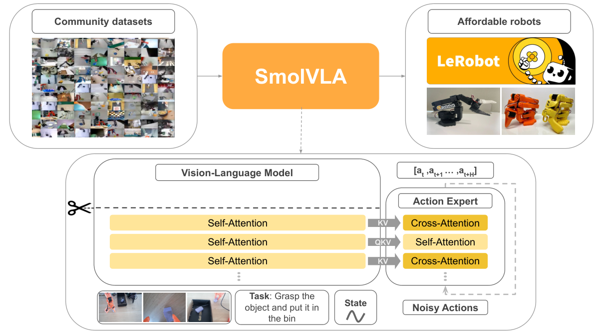
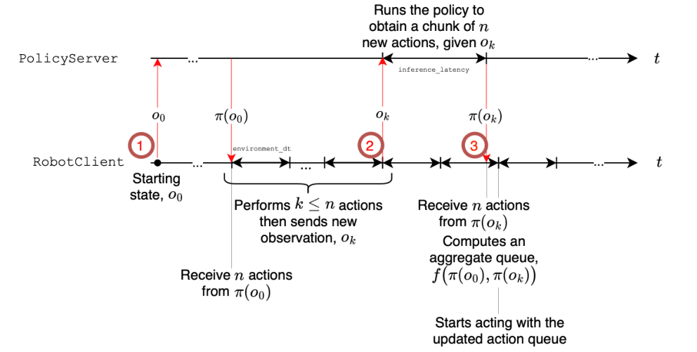
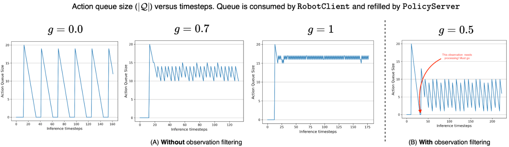
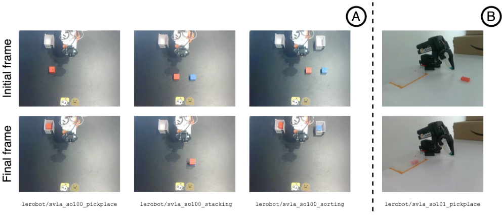

[[Home|Research Lab]]  /  [[Papers/Paper Guides|Paper Guides]]

# SmolVLA: a 450M-parameter VLA you can actually train

> [!paper] Research reading guide
> Complete reading guide for SmolVLA (arXiv 2506.01844) and LeRobot: prerequisites, knowledge graph, architecture, flow matching, asynchronous inference.
>
> **Concepts:** 4 · **Related curriculum notes:** 1

> [!concepts] Connected concepts
> - [[Mind Map/Nodes/smolvla|SmolVLA]]
> - [[Mind Map/Nodes/lerobot|LeRobot]]
> - [[Mind Map/Nodes/flow-matching|Flow matching]]
> - [[Mind Map/Nodes/async-infer|Async inference]]

> [!study] Continue in the curriculum
> - [[Curriculum/Lessons/Day 31 - Flow Matching & Optimal-Transport Paths|Day 31 - Flow Matching & Optimal-Transport Paths]]

> [!source] Local reconstruction and provenance
> - This note contains the complete recreated reading guide; no published mirror is required.
> - Canonical editorial source: `site/papers-smolvla.html`
> - Companion source: `papers/smolvla-lerobot.md`
> - Local figures: `_attachments/Papers/smolvla/`
> - Primary papers, repositories, and videos remain linked as evidence.

---

## How a person would put the cube in the bowl

A cheap tabletop arm, two webcams, joint angles, instruction “put the red cube in the bowl.” SmolVLA fuses those streams in a VLM, flow-matches a chunk of future actions, and runs the policy asynchronously so the arm does not stall while the next chunk is computed.

> [!example] Step 01 — You
> **You:** Look at the overhead camera, glance at the wrist camera, hear the sentence, notice where the arm currently is.
>
> **The paper:** Three input streams: RGB views (64 tokens each), language tokens, one proprioception token. SmolVLM-2 fuses them.

> [!example] Step 02 — You
> **You:** You do not plan the next 20 milliseconds. You plan a short sequence: reach, pinch, lift, move, open. Then you look again.
>
> **The paper:** The action expert emits a chunk $A_t=(a_t,\ldots,a_{t+n})$, not a single joint command. Same idea as ACT, generated with flow matching.

> [!example] Step 03 — You
> **You:** You do not freeze mid-reach while composing the next phrase. Your hand keeps moving; the next plan forms in parallel.
>
> **The paper:** Asynchronous inference: RobotClient drains the queue while PolicyServer computes the next chunk. Threshold $g$ is “start computing the next chunk when the current one is half executed.”

> [!example] Step 04 — You
> **You:** You learned this from watching other people on similar kitchen tables, not from a factory with ten thousand hours of proprietary video.
>
> **The paper:** Pretrain on public LeRobot community datasets (<30k episodes), with camera names forced into a consistent order.

> [!example] Step 05 — You
> **You:** You do not reread the entire manual every grasp. Once you have the gist of the scene, you stop overthinking and just move.
>
> **The paper:** Skip the last $L-N$ VLM layers ($N=L/2$). Intermediate features are enough to condition the expert.

That mapping *is* the architecture. The rest of this guide is the same five steps with the paper’s notation, diagrams, and numbers attached.

## The paper, in order — every section

Open [arXiv 2506.01844](https://arxiv.org/pdf/2506.01844) next to this. Below is the PDF’s own argument, paragraph by paragraph. Skip nothing that the authors spent a subsection on.

### Abstract

Paragraph 1: VLMs pretrained on large multimodal data already know a lot about images and language. Recent robotics work does not train policies from scratch; it *adapts* those VLMs into VLAs so a sentence plus cameras become motor commands.

Paragraph 2: Existing VLAs are typically billions of parameters. That means expensive training and poor real-world deployability. They also train on academic/industrial datasets and ignore community data from cheap arms.

Paragraph 3 (the claim): SmolVLA is small, efficient, community-driven. Train on one GPU; deploy on consumer GPU or CPU. An asynchronous inference stack decouples perception/prediction from execution so chunked actions can still run at a usable control rate. Despite the size, performance is comparable to VLAs ~10× larger. Code, models, and data are released.

Read the abstract as three constraints, not a slogan: (1) size, (2) community data, (3) async inference. Every later section exists to defend one of those.

### Figure 1 (do this before §1)



**Paper Figure 1.** Scissors = dropped late VLM layers. Gold blocks = cross-attention into the VLM; pale = causal self-attention inside the chunk. Flow matching sits in the expert, not in the VLM. Community data and cheap arms are in the caption on purpose — they are part of the claim, not decoration.

The scissors icon is not decoration: the last $L-N$ VLM layers are discarded. Three inputs merge — language, RGB view(s), sensorimotor state — then an action expert of alternating cross-attention (gold) and self-attention (pale) blocks, trained with flow matching, emits a chunk $a\_t,\dots,a\_{t+n}$. Pretraining is public community data; evaluation is low-cost robots. If you cannot redraw this figure from memory, do not start §3.1.

### §1 Introduction

The field moved to foundation models. LLMs work because of Transformers plus internet-scale text. That success spilled into VLMs and audio-language models.

The next paragraph is the turn: those models are still mostly digital. Robotic policies still fail to generalize across objects, poses, rooms, and tasks. Robots need common sense, and the bottleneck the authors name is *data* — high-quality, diverse, physical.

Later in the intro they state the VLA recipe: language instruction + camera images + proprioception → actions. They then locate SmolVLA against Octo, RT-1 (trained from scratch), RT-2 (pretrained VLM), OpenVLA (7B discrete tokens), $\pi\_0$ and DexVLA (diffusion action experts), FAST (autoregressive action tokens, slow), TinyVLA (sub-1B, no large-scale robot pretraining). SmolVLA’s stated niche: open, small, train-and-infer cheap.

### §3 Overview (before 3.1)

Two modules: compact pretrained VLM + action expert with flow matching. Inputs: multiple images + a language instruction. Output: an action chunk. Pretrain with imitation on community datasets, then evaluate real and sim. At inference they add the async stack so execution is not blocked on the next forward pass.

### §3.1 Architecture — VLM

Backbone is SmolVLM-2 (SigLIP vision + SmolLM2 decoder), chosen because it already handles multi-image/video. Images go through the vision encoder with token shuffling; they drop tiling and keep a global image plus pixel-shuffle, **64 visual tokens per frame**. Language is tokenized. Sensorimotor state is a linear projection to **one token**. Concatenate, run the language decoder, condition the expert on those features.

`64 visual / camera → L language → 1 state`

↓ concat → SmolLM2 decoder (first N layers)

`VLM features → action expert 0.75d → chunk a t …a t+n`

Figure 1 as tokens. Count the 64. The state is one vector, not a sequence.

**Layer skipping.** To cut latency they skip the last $L-N$ VLM layers (the scissors). Prior work showed pretrained transformers tolerate dropped late layers; here it is an inference budget, not a regularizer. Default $N = L/2$.

Scissors: keep the bottom half of the stack (green). Red layers are not run. $N=L/2$.

**Action expert + flow matching.** The expert $v\_\theta$ is thinner (width $0.75d$). It is trained to regress a velocity field that transports noise to an action chunk, not to denoise like $\pi\_0$’s diffusion expert and not to decode a CVAE $z$ like ACT.

**Interleaved CA and SA.** Unlike $\pi\_0$ (SA-only) or some CA-only VLAs, each expert block is *either* CA or SA, not both. CA: action tokens read VLM keys/values. SA: action tokens attend to each other with a *causal* mask so token $i$ cannot see future actions in the chunk. Empirically: higher success, faster inference; SA is what makes chunks smooth on the real robot.

CA blockactions read VLM K,VSA blockcausal within the chunkCASA

Not both in one block. Alternate. Causal SA = token $i$ cannot see $i+1$.

### §3.2 Community data

Robot pretraining data is still orders of magnitude smaller than language. Datasets are “islands”: different morphologies, sensors, frequencies, formats. Low-cost arms + LeRobot are the authors’ answer to that heterogeneity.

**Table 1:** 481 Hugging Face community datasets, 22.9k episodes, 10.6M frames — about an order of magnitude smaller than industrial VLA pretraining sets. Filtered by embodiment, episode count, quality, frame coverage.

**Task annotation.** Community labels are noisy: placeholders like “task desc”, “Hold”, “Up”, or empty. They sample frames, feed Qwen2.5-VL-3B-Instruct with the original string, and replace it with a short action-oriented sentence (prompt in Appendix A.1).

**Camera names.** `images.laptop` might be top, wrist, or side. They manually map views to `OBS_IMAGE_1/2/3` (top, wrist, side) and drop extras. Inconsistent camera order hurt this data regime; consistent order helped. They flag future VLM-based remapping or collection guidelines.

| Alternative | Representation and consequence |
|---|---|
| **As uploaded** | As uploaded images.laptop / phone / cam2 — same string, different viewpoint. |
| **After remap** | After remap OBS_IMAGE_1 top · _2 wrist · _3 side. Extras dropped. |

### §3.3 Asynchronous inference



**Paper Figure 2.** Client pops actions at the control rate. Server infers on another machine/process. The arm does not wait for the forward pass.



**Paper Figure 3.** Left: no filter, queue never empties because near-duplicate observations keep filling it. Right: joint-space filter, except the red arrow — empty queue forces an infer even on a duplicate, or the robot stalls.

Modern policies output chunks $\pi(o\_t)=\mathbf{A}\_t=(a\_t,\ldots,a\_{t+n})$. The naive loop executes the whole chunk, then looks again — open-loop for $n$ steps, plus an idle gap while the next chunk is computed.

The opposite extreme (ACT-style): predict a new chunk every timestep and ensemble overlaps. Adaptive, but you pay a forward pass every control tick — too expensive on the edge.

**Sync** = exhaust the chunk, then infer. Cheap average compute, blind lags.

**Async (Algorithm 1):** `RobotClient` pops actions at $\Delta t$; when remaining queue fraction drops below $g$, it sends $o\_t$ to `PolicyServer` without blocking. Overlaps are aggregated. Near-duplicate observations are dropped via joint-space distance $\epsilon$, except when the queue is empty (red arrow in Figure 3B) — then you always infer, or the arm stalls.

Figure 3: small $g$ → idle gaps; $g\approx 1$ → almost continuous infer. They use $g=0.7$ in the main real-robot async experiments (consume ~30% of the old chunk before requesting the next).

Queue at $g=0.7$: grey already executed, green still to run, gold = fire a new infer.

- sync pick-place — 13.75s

- async pick-place — 9.7s

### §4 Experiments — protocol first



**Paper task figure.** Start and end frames for pick-place, stack, sort. Partial credit is defined on these substeps (0.5+0.5 or 0.25×4), not a binary sim success bit.

Sim: new Meta-World dataset, 50 demos × 50 tasks. Real: three SO-100 tasks + one SO-101, 10 trajectories × 5 start poses = 50 demos each. Default training is multi-task.

**Metrics.** Sim success is binary. Real success is partial: pick-place 0.5 grasp + 0.5 place; stacking same; sorting 0.25 × 4 substeps.

LIBERO: Spatial / Object / Goal / Long, 10 tasks each, dataset `physical-intelligence/libero` (1,693 episodes), 10 trials/task. Meta-World: 2,500 episodes, same 10-trial protocol. SO-101 pick-place is *not* in pretraining.

### §4 tables — the numbers you may quote

**Table 2 (sim).** SmolVLA beats Octo and OpenVLA and a diffusion-policy baseline on LIBERO and Meta-World. Competitive with robotics-pretrained $\pi\_0$, better than VLM-initialized $\pi\_0$, ~40% faster to train and 6× less memory than $\pi\_0$. The 0.45B model is initialized from the VLM only — no extra robotics pretraining in the “VLA Pt = No” rows.

**Table 3 (SO-100 real).** Pick-place 75, stacking 90, sorting 70, average **78.3%** for 0.45B SmolVLA.

**Table 4 (SO-101).** In-distribution 90, OOD (novel Lego poses) 50. Beats ACT in both.

**Table 5.** Community pretraining is load-bearing: 51.7 → 78.3 average on the three SO-100 tasks. Multitask finetuning adds more. Do not cite 78.3 without this ablation.

- no community pt — 51.7

- with pretrain — 78.3

SO-100 average. The headline number is the green bar, not a from-scratch VLA.

**§4.6 async.** Success roughly matches sync (async average 73.3 vs sync similar). Pick-place wall-clock 13.75 s → 9.7 s (~30% faster). Fixed 60 s budget: 9 successful cycles → 19. The speed claim is throughput, not accuracy.

**§4.7 ablations** are all on LIBERO, VLM frozen, expert from scratch, no robot pretraining. Attention mechanism (CA vs SA vs interleaved) is the first table — interleaved wins on success and speed. Read every ablation row as “which scissors / width / attention choice paid for itself.”

### What the paper does *not* claim

It does not claim community 10.6M frames equal industrial fleets. It does not claim 78.3% on a different arm without finetuning. It does not claim async raises success; it claims similar success at higher throughput. Layer skip is an efficiency trick, not a new representation.

## The engineering tension

A vision-language-action model takes cameras, a language instruction, and proprioception, and emits robot actions. RT-2, OpenVLA (~7B), and $\pi\_0$ (~3B) showed that grafting a pretrained VLM onto a robot policy transfers web-scale semantics into manipulation. They also showed something less advertised: you need industrial clusters to train them and industrial arms to run them.

SmolVLA’s claim is sharper than “we made a small model.” Three constraints are treated as first-class:

1. **Train on one GPU.** The architecture is cut until this is true: skip half the VLM layers, 64 visual tokens per frame, action expert hidden size $0.75d$.
2. **Deploy on consumer GPUs or CPUs**, including MacBooks, not just A100s.
3. **Pretrain only on public community datasets** from affordable robots (SO-100 / SO-101 class), fewer than 30k episodes, rather than Open-X-Embodiment-scale proprietary fleets.

If those constraints hold and the model still matches VLAs that are $7$–$10\times$ larger, then “bigger is better” is not a law of robotics — it is an artifact of closed data and closed hardware. That is the paper you are reading.

Do not confuse this SmolVLA (Hugging Face / LeRobot, arXiv 2506.01844, ~450M, community data) with an unrelated 2024 preprint that reused a similar name. Primary identifiers: authors Shukor, Aubakirova, Capuano, Cadène, Wolf; code in `huggingface/lerobot`; weights `lerobot/smolvla_base`.450M params
1 GPU train
flow matching
async stack
<30k episodes

> [!flow] Architecture / data flow
> **Cameras** — RGB views → 64 tokens each + **Language** — task instruction tokens + **Proprio** — 1 projected state token
> ↓
> **SmolVLM-2 (first N = L/2 layers)** — SigLIP vision + SmolLM2 decoder · last layers skipped
> ↓ features condition
> **Action expert** — interleaved CA / causal SA · width 0.75d · flow matching
> ↓
> **Action chunk A t = (a t … a t+n )** — async queue on the robot · PolicyServer can be remote

Figure. SmolVLA datapath. Green is perception, lilac is motor generation, ink is what the arm actually executes.

### Prerequisites you actually need

Backspan only what the paper uses. You do not need a full VLM course before section 3; you need the five ideas below at the level where you could explain them on a whiteboard.

1. **01**

   #### Behavior cloning and compounding error

   Supervised map $o\_t \mapsto a\_t$ from demonstrations. A 1% action error, integrated at 30–50 Hz over a 20-second episode, leaves the robot in states the dataset never showed. Ross & Bagnell (DAgger, 2011) named this. ACT (the next guide) treats it as a *horizon* problem by predicting chunks. SmolVLA inherits chunks and then asks a systems question: who waits while the chunk is computed?
2. **02**

   #### Vision-language models, not “transformers in general”

   A VLM is a vision encoder (here SigLIP) whose tokens are consumed by a language decoder (here SmolLM2). SmolVLM-2 is already trained for multi-image / video. SmolVLA does not train a VLM from scratch; it *conditions an action expert on VLM features*. If you have never seen cross-attention from a decoder onto encoder keys/values, stop and draw that before §3.1.

> [!video] 3Blue1Brown: Transformers, the tech behind LLMs
> [Watch video](https://www.youtube.com/watch?v=wjZofJX0v4M)
>
> Watch if attention is rusty. 3Blue1Brown, “Transformers (how LLMs work) explained visually.” Then come back to SigLIP tokens feeding SmolLM2.

3. **03**

   #### Continuous actions vs tokenized actions

   OpenVLA discretizes each action dimension into bins and emits tokens autoregressively. That is slow and coarse. $\pi\_0$ and SmolVLA emit *continuous* action chunks. The generator is not a next-token LLM head; it is a flow-matching transformer (the “action expert”).
4. **04**

   #### Flow matching, one picture

   Diffusion learns a score $\nabla \log p\_t$. Flow matching learns a velocity field $u\_t$ that transports noise $x\_0 \sim \mathcal{N}(0,I)$ to data $x\_1$ along (approximately) straight paths $x\_t = (1-t)x\_0 + t x\_1$. Training is an $L\_2$ regression onto that velocity. Inference is an ODE. Fewer steps than diffusion, which matters when you must emit 50 actions inside a control cycle.

> [!video] Flow Matching explanation and PyTorch implementation
> [Watch video](https://www.youtube.com/watch?v=7cMzfkWFWhI)
>
> Outlier, “Flow Matching | Explanation + PyTorch Implementation” (22 min). Watch the first ~6 minutes for the straight-path picture SmolVLA uses.

5. **05**

   #### Real-time control as a queue, not a function call

   A 50-step chunk at 30 Hz is 1.7 seconds of motion. If you finish the chunk, then block on a forward pass, the arm pauses. If you re-query every timestep (temporal ensembling), you need a GPU on the robot. Asynchronous inference is the third option: predict the next chunk *while* the current queue drains. This is a systems paper as much as a modeling paper.

### Knowledge graph

Center is the claim. Left ring = ideas it consumes. Right ring = where those ideas live on the page and in the literature. Click a paper node.

[ACT chunks](https://arxiv.org/abs/2304.13705)
[flow matching](https://arxiv.org/abs/2210.02747)
[[Papers/ACT and ALOHA|compounding error]]
[OpenVLA 7B](https://arxiv.org/abs/2406.09246)SmolVLA450M · community data · asyncSmolVLM-2 · 64 tok
layer skip N=L/2
OBS\_IMAGE remap
g=0.7 queue

foundations  method pieces  problems it solves  heavier VLAs it refuses

```text
supervised BC → compounding error → ACT chunks
VLM (SigLIP+SmolLM2) → skip L−N → features → flow expert
community data + camera hygiene → async RobotClient/PolicyServer
evaluate: SO-100/101, LIBERO, Meta-World
```

> [!graph] Concept flow
> **behavior cloning**
> ↓ compounding error
> **single-step BC · action chunks (ACT)**
> ↓ + language + vision
> **SmolVLM-2 · flow expert · community data**
> ↓
> **SmolVLA + async queue**
> ↓
> **SO-100 / LIBERO**

Directed graph of the paper. Each arrow is a dependency SmolVLA actually uses, not a generic ML taxonomy.

### How to read the PDF (once)

1. **Figure 1** until you can redraw the scissors (layer skip), the three input streams, and the action expert without looking.
2. **§3.1 architecture** with a pencil: token counts, projectors, $N=L/2$.
3. **Flow-matching loss** (the displayed $\mathcal{L}^\tau$) and the Beta schedule for $\tau$. Compare mentally to $\pi\_0$.
4. **§3.2 data** — this is the underrated section. Camera renaming is not a footnote; it is why community data is usable.
5. **§3.3 + Algorithm 1** async inference. Draw the queue vs wall clock.
6. **Experiments last.** Separate simulation (binary success) from real-world (sometimes partial credit). Do not quote a single 78.3% without the baseline next to it.

### Architecture, token by token

Two modules, tightly coupled. The VLM *perceives*; the action expert *acts*. Actions change the next observation, which changes the next VLM features. That loop is the robot.

### Inputs

- **RGB image(s)** from one or more cameras. SmolVLM-2 was trained with image tiling (multiple crops + global image). SmolVLA *drops tiling at inference* and keeps only the global image, then pixel-shuffles so each frame becomes **64 visual tokens**. That is the main visual-cost knob.
- **Language instruction**, tokenized as ordinary text tokens.
- **Sensorimotor / proprioceptive state**, linearly projected to *one* token at the language-model width.

Visual, language, and state tokens are concatenated and consumed by the SmolLM2 decoder, but only through the first $N$ layers. Features from those layers condition the action expert. The remaining $L-N$ decoder layers are never run — the scissors in Figure 1.

### Why skip layers instead of distilling a smaller VLM?

Two empirical facts from the VLM literature, used explicitly:

1. You can drop later layers of a pretrained decoder with surprisingly small downstream damage.
2. The *best* features for a downstream head are often not the last layer. Intermediate features can be more linearly useful.

Setting $N = L/2$ halves both VLM compute and, because the expert is conditioned on those features, a large fraction of expert compute. It is a free (almost) 2× on the language stack. The ablation you want in the paper is exactly this $N$ vs success-rate curve — if a number is reported only at $N=L/2$, treat the “halving is free” claim as a working hypothesis, not a theorem.

### Action expert

A transformer $ \mathbf{v}\_\theta $ that outputs a chunk $\mathbf{A}\_t = (a\_t,\ldots,a\_{t+n})$. Hidden width is $0.75d$ relative to the VLM. Blocks *interleave* cross-attention and causal self-attention rather than stacking both in every block:

- **Cross-attention (CA)** — action queries attend to VLM keys/values. This is how vision and language enter the motor command.
- **Causal self-attention (SA)** — action tokens attend only to earlier tokens in the same chunk. The paper finds SA is what makes chunks *smooth* on real robots; CA alone is twitchier.

This interleaving is a deliberate departure from $\pi\_0$ (mostly self-attention over a combined stream) and from some concurrent VLAs that are CA-only. Empirically they report both higher success and faster inference than either pure pattern.

Linear projectors appear in three places: state → VLM width, action → expert width, VLM features → expert width. They are not “details”; they are the only learned interfaces between two modules that were not trained together from scratch.

### Flow matching, in the paper’s notation

Let $\mathbf{A}\_t$ be a ground-truth action chunk given observation $\mathbf{o}\_t$. A noisy interpolant $\mathbf{A}\_t^\tau$ is drawn from $q(\mathbf{A}\_t^\tau \mid \mathbf{A}\_t)$, with time $\tau$ sampled from a **Beta distribution** (same trick as $\pi\_0$, concentrating samples where the path is most informative). The expert predicts a velocity; the target velocity is the closed-form $ \mathbf{u}(\mathbf{A}\_t^\tau \mid \mathbf{A}\_t) $ of the chosen interpolant. Training is

$$\mathcal{L}^{\tau}(\theta)=\mathbb{E}\_{p(\mathbf{A}\_t\mid\mathbf{o}\_t),\,q(\mathbf{A}\_t^{\tau}\mid\mathbf{A}\_t)}\Big[\big\|\mathbf{v}\_{\theta}(\mathbf{A}\_t^{\tau},\mathbf{o}\_t)-\mathbf{u}(\mathbf{A}\_t^{\tau}\mid\mathbf{A}\_t)\big\|^{2}\Big].$$

Flow-matching regression. Compare to a diffusion denoising score-matching loss: same $L\_2$ shape, different target, usually fewer ODE steps at sample time.

**Why flow matching rather than diffusion or CVAE?**

> [!diagram] Straight flow-matching path versus wiggly diffusion path
> noise · action chunk · diffusion (curved score path) · flow matching (almost-straight ODE)

Same endpoints. Fewer function evaluations on the green path — what you need when a 50-step chunk has to land inside a control cycle.

SmolVLA
0.45Bπ₀
~3.3BOpenVLA
7B

Parameter count, not quality. The paper’s claim is that the short bar matches the tall ones on their suite.

- Versus ACT’s CVAE: no style latent $z$ to set to zero at test time; multimodal demonstrations are absorbed into the flow. Chunks are still the output, so you keep ACT’s horizon reduction.
- Versus $\pi\_0$ diffusion: straighter paths, fewer function evaluations, cheaper expert ($0.75d$).
- Versus OpenVLA tokens: one (or a handful of) ODE steps produce a *continuous* 50-step chunk instead of hundreds of autoregressive tokens.

At control time you do not need a perfect ODE. You need a chunk that is good enough that the async stack can overlap the next forward pass. That is a different objective than image-generation FID.

### Asynchronous inference — the systems contribution

Three regimes, only one of which SmolVLA ships as the point:

| Regime | When you query $\pi$ | What the arm does during compute | Cost |
| --- | --- | --- | --- |
| Synchronous chunk | After the queue is empty | Idle (blind lag) | Cheap, laggy |
| Every-timestep ensemble (ACT-style) | Every $\Delta t$ | Moves, but GPU must keep up | Smooth, expensive |
| Async (this paper) | When remaining queue fraction hits $g$ | Drains old queue; merges new chunk on arrival | Responsive without per-tick inference |

Algorithm 1: a `RobotClient` streams observations to a `PolicyServer` (possibly remote, possibly GPU). The client pops actions from a queue at the control rate $\Delta t$ (about 33 ms at 30 Hz). When the remaining fraction of the queue drops below threshold $g$, it fires a *non-blocking* infer. On return, overlapping prefixes are aggregated, $ \mathbf{A}\_{t+1} \leftarrow f(\mathbf{A}\_t, \tilde{\mathbf{A}}\_{t+1}) $.

Idle gaps vanish when $ g \ge (\mathbb{E}[\ell\_S]/\Delta t)/n $, where $\ell\_S$ is server-side latency and $n$ is chunk length. Communication time is treated as negligible next to $\ell\_S$. Near-duplicate observations are dropped using a joint-space distance $\epsilon$, except when the queue is empty — then you always infer.

Reported real-robot effect: similar success rate to sync, about **30% shorter wall-clock task time**, because the arm stops waiting. Do not read this as “the model is 30% more accurate.”

| Alternative | Representation and consequence |
|---|---|
| **Synchronous chunk** | Synchronous chunk Predict 50 steps Arm idle while GPU thinks Execute, then think again Cheap. Laggy. Blind every n steps. |
| **Async (this paper)** | Async (this paper) Arm drains the queue At g, fire a non-blocking infer Blend the new chunk on arrival Same success, ~30% shorter task time. |

Ensembling every tick (ACT) is a third pane: smooth, but the GPU must keep up.

**t = 0**Observation sent to PolicyServer. Queue fills with a 50-step chunk.**t ≈ 0.8 s (g = 0.5)**Non-blocking infer starts while the arm still drains the old queue.**t ≈ 1.0 s**New chunk arrives (~200 ms latency). Overlap is blended. Queue never hits zero.**If the cube slips**Joint-space filter fails → infer immediately, even before g.If you only remember one systems sentence: chunking without async still leaves a pause every $n$ steps; ensembling without async still needs a GPU in the loop. Async is how a 450M flow model on a remote box drives a cheap arm at a useful rate.

### Community data is the dataset paper hiding inside the model paper

Pretraining uses fewer than 30k episodes, on the order of 10 million frames, from hundreds of public LeRobot datasets (community SO-100 / SO-101 style arms), not OXE. That is an order of magnitude less than several foundation-VLA training sets, and it is noisier.

The operational problem is **camera naming**. `images.laptop` might be a top camera in one repo and a wrist camera in another. The authors manually mapped views onto a canonical order — top, wrist, side — renamed `OBS_IMAGE_1/2/3`, and dropped extras. They state that consistent ordering mattered in this data regime. Future work they flag: VLM-based remapping, or actual collection guidelines.

When you fine-tune SmolVLA on your own SO-100, you inherit this convention. If your cameras are in a different order than pretraining, you are not “using the base model”; you are silently domain-shifting the vision stream.

### Results, with the comparison class attached

Numbers below are the ones the paper and the accompanying communications actually put next to named baselines. Always carry the baseline; never tweet a lone percentage.

| Setting | SmolVLA (~450M) | Named comparison |
| --- | --- | --- |
| LIBERO (sim) | ~87.3% success | Competitive with OpenVLA (7B) and $\pi\_0$ (~3.3B) |
| Meta-World (sim) | ~57.3% | Same comparison class |
| Real SO-100/101 (pick, stack, sort) | ~78.3% average | ACT ~80M: 48.3%; $\pi\_0$ 3.5B: 61.7% |
| Async vs sync (real) | Similar success, ~30% faster task time | Sync SmolVLA |

- LIBERO · SmolVLA 0.45B — 87%

- LIBERO · π₀ 3.3B — 86%

- LIBERO · OpenVLA 7B — 77%

- Real · SmolVLA — 78%

- Real · π₀ 3.5B — 62%

- Real · ACT 80M — 48%

Same evaluation suite as the paper/blog. Green is SmolVLA. Do not mix sim bars with real bars into one average.

How to think about this table:

- Simulation success is typically binary completion. Real-world scores in this literature sometimes award partial credit. Do not average them.
- Beating ACT on the same cheap hardware is the fair comparison. Beating $\pi\_0$ is the provocative one, and it depends on the exact $\pi\_0$ checkpoint and whether that run used the same tasks and scoring.
- “Comparable to 10× larger VLAs” is a statement about *this evaluation suite*, not a universal dominance claim.

### LeRobot is not a citation — it is the runtime

SmolVLA is a policy class inside Hugging Face LeRobot. The paper without the library is a PDF; the library without the paper is ACT/diffusion recipes. Together they are the thing you can run.

> [!video] LeRobot Tutorial #4: Record Dataset
> [Watch video](https://www.youtube.com/watch?v=n_Ljp_xuFEM)
>
> Hugging Face, LeRobot Tutorial #4 — Record Dataset (Simon Alibert). The data path SmolVLA fine-tunes on.

> [!video] Assemble and Calibrate SO-100
> [Watch video](https://www.youtube.com/watch?v=FioA2oeFZ5I)
>
> Hugging Face, LeRobot Tutorial #7 — Assemble and Calibrate SO-100. The cheap arm in the real-world table.

- Install extra: `pip install "lerobot[smolvla]"`.
- Base weights: `lerobot/smolvla_base` (~450M, safetensors).
- Inputs at the library boundary: multi-view images, proprio/state, optional language. Outputs: continuous actions. Objective: flow matching.
- Intended use of the base model: *fine-tune on your task*, not zero-shot your custom kitchen.
- Sibling policies in the same API: ACT, diffusion, etc. That is why this guide is “SmolVLA + LeRobot”: the comparisons are one training entrypoint away.

When you read a LeRobot training log, map it back to the paper: chunk size $n$ (often 50 in secondary writeups), camera keys matching `OBS_IMAGE_*`, and whether async is on. Those three knobs change measured success more than most optimizer tweaks.

### Worked intuition: one pick-and-place cycle

Suppose a 50-step chunk, 30 Hz, $g = 0.5$, server latency $\ell\_S \approx 200$ ms.

1. Observation $o\_0$: overhead + wrist images, joint vector, instruction “put the cube in the bowl.”
2. VLM: 64 tokens/image + text + 1 state token → first $N$ decoder layers → feature tensor.
3. Expert: flow-match from noise to a 50× action-dim trajectory (joint targets or deltas, depending on the LeRobot config).
4. Client enqueues 50 actions. After ~25 pops (0.8 s), remaining fraction hits $g$. Non-blocking infer starts.
5. While infer runs (~200 ms ≈ 6 control ticks), the arm continues the old chunk. New chunk arrives, overlap is blended, queue never hits zero.
6. If the cube slips, the next $o\_t$ is *not* a near-duplicate (joint-space filter fails), so you infer even before $g$. That is closed-loop behavior without per-tick GPU.

Contrast ACT: you would either execute 100 steps open-loop or ensemble every tick. Contrast OpenVLA: you would autoregress tokens for one action, then the next, and miss the 30 Hz budget on a laptop.

### Caveats the paper is honest about, and a few it cannot be

- Community data is heterogeneous. Camera mapping is manual. Reproducing pretraining without their map will not match the blog numbers.
- Layer skip $N=L/2$ is a chosen operating point. Do not assume last-layer features are worse on *your* downstream task without checking.
- Async helps wall-clock task time; it does not magically raise success if the chunk itself is wrong.
- Real-world 78% is on their SO-100/101 task suite, not a guarantee for your gripper, lighting, or latency.
- Frozen vs trained VLM pieces, exact LeRobot version, and whether language is used at eval time all move numbers. Read the checkpoint card.

### Study plan (use this, then the PDF)

1. Redraw Figure 1 from memory. If the scissors or the CA/SA interleave is missing, you are not ready for experiments.
2. Write the flow-matching loss without looking. Name $\tau$’s distribution.
3. Derive the idle-avoidance inequality for $g$ with your own $\ell\_S$, $\Delta t$, $n$.
4. Skim ACT (next guide) only through chunking + ensembling, then return here to see what async changes.
5. Run LeRobot’s SmolVLA path on a recorded dataset (no robot required) and dump one chunk. Confirm dimensionality $n \times a$.
6. Only then read the experimental tables, with this guide’s comparison class in mind.

### Constellation — read these next

These are the nodes the graph is standing on. Primary papers only. Our ACT guide covers the chunking node.

- **chunks**

  #### [[Papers/ACT and ALOHA|ACT / ALOHA · arXiv 2304.13705]]

  Where action chunks, CVAE, and temporal ensembling come from. SmolVLA keeps the chunk, drops the CVAE.
- **flow**

  #### [Flow Matching for Generative Modeling · Lipman et al.](https://arxiv.org/abs/2210.02747)

  The velocity-field objective the action expert actually trains. Straighter paths than diffusion — why 0.75d is enough.
- **VLA**

  #### [OpenVLA · Kim et al., 7B discrete tokens](https://arxiv.org/abs/2406.09246)

  The heavy open baseline SmolVLA is sized against. Read the tokenization section to see what flow matching is refusing.
- **π₀**

  #### [π₀ · Black et al.](https://arxiv.org/abs/2410.24164)

  Diffusion action expert on a Paligemma VLM. Same VLA recipe, ~7× the parameters and a slower sampler.
- **VLM**

  #### [SmolVLM · Marafioti et al.](https://arxiv.org/abs/2504.05259)

  The perception backbone (SigLIP + SmolLM2). Layer skip only makes sense after you know this model.

### Primary sources

Use these, not secondary explainers, as authority.

- Paper: [arXiv:2506.01844](https://arxiv.org/abs/2506.01844) — Shukor et al., 2 Jun 2025.
- HTML: [ar5iv HTML](https://ar5iv.labs.arxiv.org/html/2506.01844).
- Official blog (authors): [huggingface.co/blog/smolvla](https://huggingface.co/blog/smolvla).
- Code: [github.com/huggingface/lerobot](https://github.com/huggingface/lerobot).
- Weights: [lerobot/smolvla\_base](https://huggingface.co/lerobot/smolvla_base).
- LeRobot ACT docs (for the chunking baseline): [huggingface.co/docs/lerobot/act](https://huggingface.co/docs/lerobot/act).
- Backspan lectures: LeRobot team ACT tutorial (YouTube, search the exact title on the HF channel); Lipman et al. flow-matching talks; Berkeley/Stanford imitation-learning lectures on compounding error.

**BibTeX**

```
@article{shukor2025smolvla,
  title={SmolVLA: A Vision-Language-Action Model for Affordable and Efficient Robotics},
  author={Shukor, Mustafa and Aubakirova, Dana and Capuano, Francesco
          and Kooijmans, Pepijn and Palma, Steven and Zouitine, Adil
          and Aractingi, Michel and Pascal, Caroline and Russi, Martino
          and Marafioti, Andres and Alibert, Simon and Cord, Matthieu
          and Wolf, Thomas and Cadene, Remi},
  journal={arXiv preprint arXiv:2506.01844},
  year={2025}
}
```
